# projet-13 version pre 17/07/2023
## Mettez à l'échelle une application Django en utilisant une architecture modulaire


<p align="center">
  <a href="https://www.python.org">
    
  </a>
  <a href="https://www.djangoproject.com">
    
  </a>
  <a href="https://hub.docker.com/repository/docker/casegibson/oc-p13/">
    
  </a>
  <a href="https://dashboard.render.com/web/srv-cio5g45ph6ei90e0h65g/">
    
  </a>
  <a href="https://none-0cu.sentry.io/issues/">
  </a>
</p>

## Index

1. [Objectifs du projet 13](#objectifs)
2. [Développement local](#devlocal)
   1. [Prérequis](#devlocal-prereq)
   2. [Linting](#devlocal-linting)
   3. [Tests unitaires](#devlocal-pytest)
   4. [Base de données](#devlocal-bdd)
   5. [Générer un fichier d'environnement](#devlocal-env)
   6. [Démarrer le site web, en local](#devlocal-start)
   7. [Administration](#devlocal-admin)
3. [Docker](#docker)
   1. [Docker local](#docker-local)
   2. [Docker pull](#docker-pull)
4. [Pre-commit](#pre-commit)
   1. [Description](#pre-commit-description)
   2. [Prérequis](#pre-commit-prereq)
   3. [Utilisation manuelle](#pre-commit-manuelle)
5. [Déploiement](#deploiement)
   1. [Description](#deploiement-description)
   2. [Prérequis](#deploiement-prereq)
   3. [Configuration](#deploiement-configuration)
6. [Sentry](#sentry)
   1. [Prérequis](#sentry-prereq)
   2. [Installation](#sentry-install)
7. [Commande utile](#commande-utile)


## Objectifs du projet 13 <a name="objectifs"></a>

1. Réduire la dette technique pour le site web d'Orange County Lettings
   - Corriger les erreurs de linting
   - Corriger la pluralisation des noms de models

2. Refonte de l'architecture modulaire du site
   - Division du site en 3 applications (profiles, lettings et oc_lettings_site)
   - Transformer oc_lettings_site en projet django
   - Créer divers tests

3. Ajout d'un pipeline CI/CD
   - Instaurer des tests (linting, black) en pre-commit
   - Executer à nouveau les tests pendant un push
   - construire et push une image du site avec Docker (sur dockerhub)
   - Déployer le site avec Render

4. Surveillance avec sentry


## Développement local <a name="devlocal"></a>

### Prérequis <a name="devlocal-prereq"></a>

Installez la dernière version de python , **disponible** [**ici**](https://www.python.org/downloads/)

Importez le projet depuis git: `git clone https://github.com/thomas-barbato/projet-13.git`

Créez un environnement virtuel :
`python3 -m venv /path/to/new/virtual/environment`
Ou `python -m virtualenv venv`

Activez l'environnement virtuel:
`cd Venv\Scripts\`
`.\activate.bat`
`cd .. `
`cd .. `

Installez les dépendances:
`pip install -r requirements.txt`

#### Linting <a name="devlocal-linting"></a>

- `cd /path/to/projet-13`
- `flake8`

#### Tests unitaires <a name="devlocal-pytest"></a>

- `cd /path/to/projet-13`
- `pytest`

#### Base de données <a name="devlocal-bdd"></a>

- `cd /projet-13/oc_lettings_site/`
- Ouvrir une session shell :`sqlite3`
- Se connecter à la base de données : `.open oc-lettings-site.sqlite3`
- Afficher les tables dans la base de données : `.tables`
- Afficher les colonnes dans le tableau des profils : `pragma table_info(oc_lettings_site_profile);`
- Lancer une requête sur la table des profils : `select user_id, favorite_city from
  oc_lettings_site_profile where favorite_city like 'B%';`;
- `.quit` pour quitter

#### Générer un fichier d'environnement <a name="devlocal-env"></a>

Vous allez devoir ensuite générer un fichier .env, à completer.
Pour ce faire, entrez la commande suivante depuis le dossier root ( "." ) du projet:
`python .\setup_env.py`

Cela créera un fichier .env, exemple:

`DJANGO_SECRET_KEY=#j*#_9ku=udx^#d4op66^b@%1$0tkjqz=alcp-b@k-78=+-%6$`

`SENTRY_DSN=https://8818e1035f7441f4bb83c122d9388456@o4505601723269120.ingest.sentry.io/4505624010227712`

*Attention à ne pas mettre d'espace entre le nom de la variable, le symbole = et la valeur.*

#### Démarrer le site web, en local <a name="devlocal-start"></a>
`python manage.py runserver`

#### Panel d'administration <a name="devlocal-admin"></a>

- Aller sur `http://localhost:8000/admin`
- Connectez-vous avec l'utilisateur `admin`, mot de passe `Abc1234!`

#### Docker <a name="docker"></a>

##### Pour créer une image docker et la lancer localement <a name="docker-local"></a>

- Téléchargez et installez docker desktop, disponible ici :
  1. **Windows**: [**ici**](https://desktop.docker.com/win/main/amd64/Docker%20Desktop%20Installer.exe?utm_source=docker&utm_medium=webreferral&utm_campaign=dd-smartbutton&utm_location=module)
  2. **Linux**: [**ici**](https://docs.docker.com/desktop/linux/install/)


- Lancez Docker desktop
- Depuis une console dans le répertoire du projet, entrez : `docker build -t nomImage .`
- Pour activer l'image: `docker run --rm -p 8000:8000 --name nomContainer nomImage`\
***attention, nomImage doit être le meme que lors du build.***
- Pour y accéder: http://localhost:8000

##### Pour créer une image docker et la lancer localement, depuis dockerhub  <a name="docker-pull"></a>

- Téléchargez et installez docker desktop, disponible ici :
  1. **Windows**: [**ici**](https://desktop.docker.com/win/main/amd64/Docker%20Desktop%20Installer.exe?utm_source=docker&utm_medium=webreferral&utm_campaign=dd-smartbutton&utm_location=module)
  2. **Linux**: [**ici**](https://docs.docker.com/desktop/linux/install/)

- Lancez Docker Desktop
- Depuis une console, entrez : `docker pull casegibson/oc-p13:latest`
- Pour activer l'image: `docker run --rm -p 8000:8000 --name nomContainer casegibson/oc-p13`
- Pour y accéder: http://localhost:8000

## Pre-commit <a name="pre-commit"></a>

### Description <a name="pre-commit-description"></a>

Pre-commit aide à exécuter une commande ou un script lorsqu'une action de commit est déclenchée.
*(selon la configuration choisie)* si ce que vous voulez soumettre est conforme à ce qui est attendu.

### Prérequis <a name="pre-commit-prereq"></a>

Pour activer le pre-commit, vous aurez besoin d'installer la bibliothèque liée.

Entrez: `pip install -r requirements-dev.txt`

### Utilisation manuelle et configuration <a name="pre-commit-manuelle"></a>

Dans le cas où voudriez vous-même tester le bon fonctionnement du pre-commit:

Entrez: `pre-commit run --all-files`

Dans le cas où vous voudriez modifier sa configuration,\
modifiez le fichier [.pre-commit-config.yaml](https://github.com/thomas-barbato/projet-13/blob/master/.pre-commit-config.yaml)

## Déploiement <a name="deploiement"></a>

### Description <a name="deploiement-description"></a>

Lorsque l'on push vers la branche **master**, le déploiement de l'application est automatisé grace au pipeline CI/CD "github actions - django".
Le fichier [**django.yml**](https://github.com/thomas-barbato/projet-13/blob/master/.github/workflows/django.yml) vous permet de modifier la configuration du déploiement.

### Prérequis <a name="deploiement-prereq"></a>

Pour effectuer le déploiement de l'application, vous aurez besoin de créer un compte sur les plateformes suivantes :

- [**GitHub**](https://github.com)
- [**Render**](https://render.com/)
- [**Docker**](https://hub.docker.com/)
- [**Sentry**](https://sentry.io/)

**Si les tests sont approuvés** :
- Une image docker est créée et uploadée vers dockerhub
- déploiement vers Render

## Configuration du déploiement <a name="deploiement-configuration"></a>

Pour faire fonctionner le pipeline CI/CD, vous devrez créer un **Web Service** sur le site [**Render**](https://render.com/),
il vous permettra d'héberger votre site web.

Pour ce faire :

1. Assurez-vous d'avoir un compte [**GitHub**](https://github.com)

2. Connectez-vous à votre compte [**Render**](https://render.com/)

3. Cliquez sur **New** et sélectionnez **Web Service**
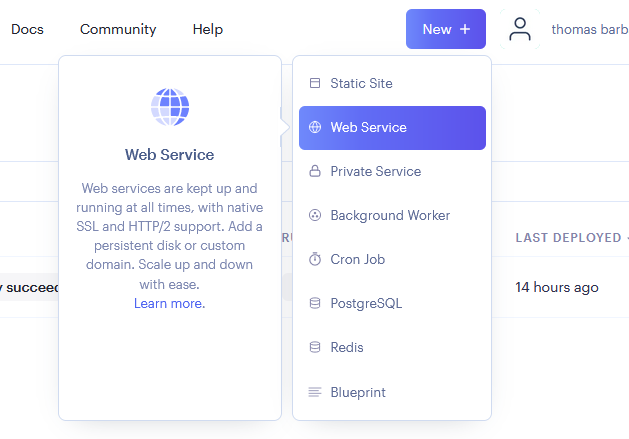

4. Liez votre compte Render à votre compte GitHub
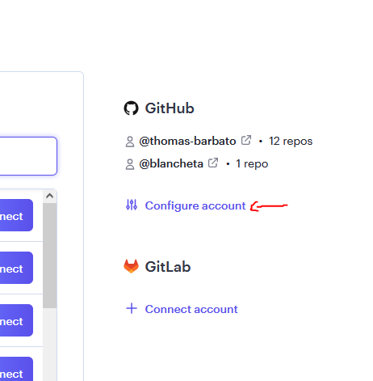

5. Les repository liés au compte GitHub s'affichent, cliquez sur **connect** pour sélectionner celui qui vous intéresse.
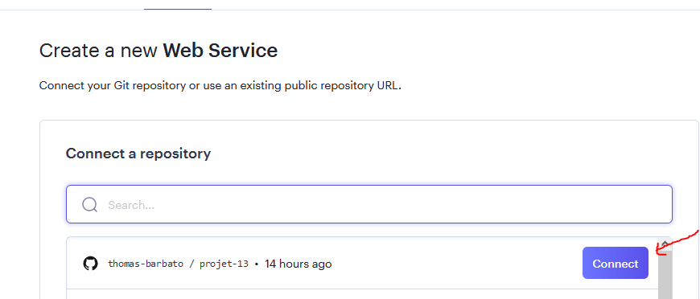

6. Vous apparaitrez alors sur la page de déploiement, veillez à remplir correctement les informations demandées.\
**Attention**, dans la section **Runtime** vous pouvez choisir docker (vous n'aurez rien d'autre à entrer avec ce choix),
ou Python3, auquel cas vous devrez entrer la commande suivante :\
`waitress-serve --listen=*:8000 wsgi:application` \
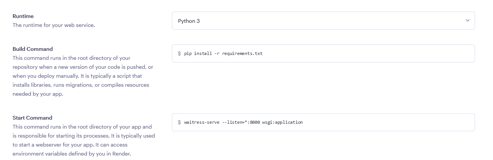
Pour Linux, c'est gunicorn qui est utilisé à la place de waitress, à vous d'adapter selon vos besoins.
Pour cet exemple, nous allons faire le choix de docker
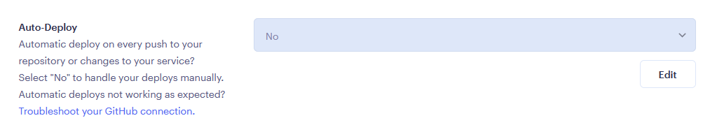
Concernant **Auto-Deploy**, sélectionnez **No**, sinon, Render n'attendra pas la fin des vérifications du pipeline pour lancer le déploiement.
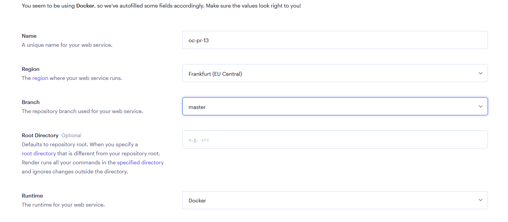
7. Cliquez sur **confirmer**
8. Le déploiement commence, patientez
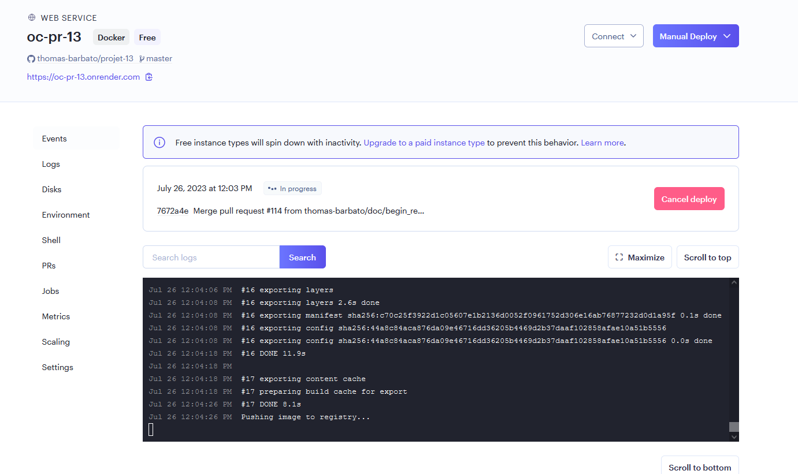
9. Une fois terminé, vous allez être redirigé vers **overview**
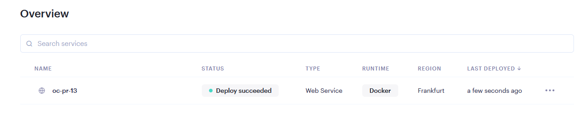

### Renseigner les variables secretes de github

Avant tout, vous devrez créer des variables **Secrets** dans votre github.\
Pour y accéder

Veuillez vous rendre dans le menu **Settings** de github\
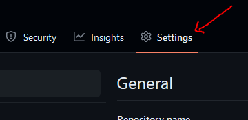

Déroulez le menu **Secrets and Variables** dans la partie **Security**, puis cliquez sur **Secrets**

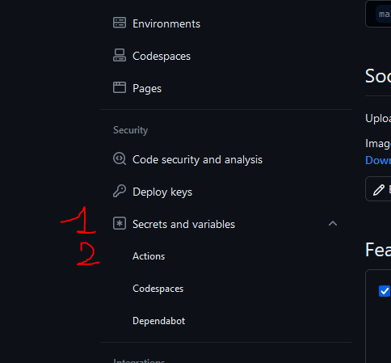

Vous pourrez alors y créer et/ou consulter les variables secretes qui sont liées à ce projet

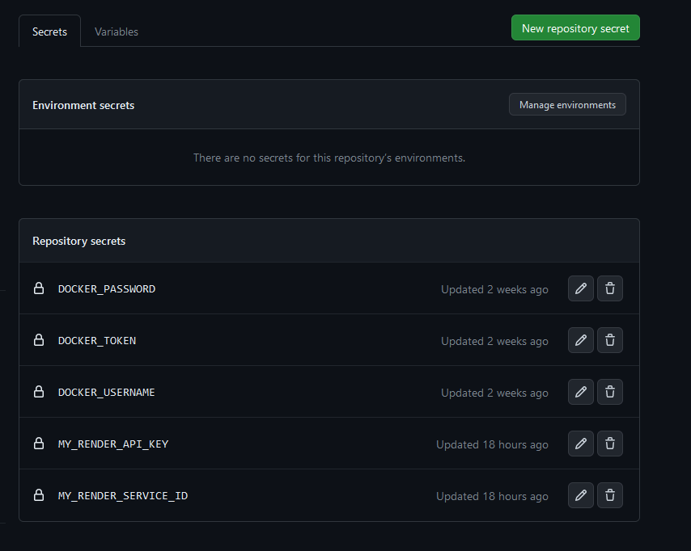

Pour créer une nouvelle variable, veuillez cliquer sur **New Repository Secret**

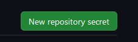
1. entrez un nom
2. entrez une valeur
3. cliquez sur Add secret\
*attention, les espaces ne sont pas tolérés*

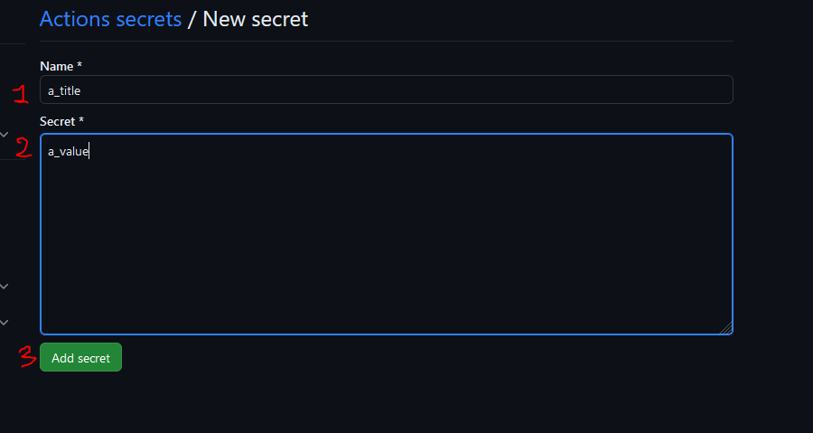

Vous devrez alors, pour faire fonctionner le projet 13, insérer plusieurs variables.\
Suivez les indications suivantes :

|  Nom de la variable  |                                                                                                                                                                      Informations                                                                                                                                                                       |
|:--------------------:|:-------------------------------------------------------------------------------------------------------------------------------------------------------------------------------------------------------------------------------------------------------------------------------------------------------------------------------------------------------:|
|     DOCKER_TOKEN     | Sur le site [**Docker**](https://hub.docker.com/), dans votre profil cliquez sur **Account Settings** puis **Security** et **New Access Token**, veillez à bien noter la valeur qui sera générée car vous ne pourrez pas la récupérer autrement, donnez les accès **Read, Write, Delete**. La clé commence toujours par la suite de caractères **dckr** |
|   DOCKER_USERNAME    |                                                                                                                    Sur le site [**Docker**](https://hub.docker.com/), votre nom d'utilisateur définit à la création de votre compte                                                                                                                     |
|  MY_RENDER_API_KEY   |     Sur le site [**Render**](https://render.com/) , cliquez sur votre profile, puis sur **Account Settings** puis sur **API Keys**, ensuite sur **Create API Key**, entrez un nom et veillez à bien noter la valeur qui sera générée car vous ne pourrez pas la récupérer autrement  . La clé commence toujours par la suite de caractères **rnd_**     |
| MY_RENDER_SERVICE_ID |                            Sur le site [**Render**](https://render.com/), sélectionnez le **Web Service** déjà créé puis, rendez-vous **settings**, vous y trouverez **Deploy Hook** et copiez-coller la ligne qu'elle contient. La clé commence toujours par la suite de caractères **https://api.render.com/deploy/srv-**                             |

## Sentry <a name="sentry"></a>

### Prérequis <a name="sentry-prereq"></a>

Assurez-vous tout d'abord d'être connecté sur [**sentry.io**](https://sentry.io) et d'avoir installé la bibliothèque **sentry-sdk présente dans requirements.txt**

### Installation <a name="sentry-install"></a>

Créez un nouveau projet sur votre compte sentry :

Cliquez sur **projets** :

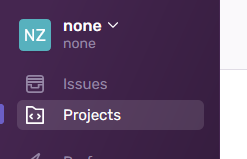

Cliquez sur **Create project** :

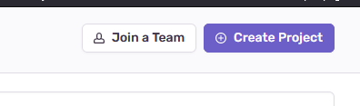

Sélectionnez **Django** :

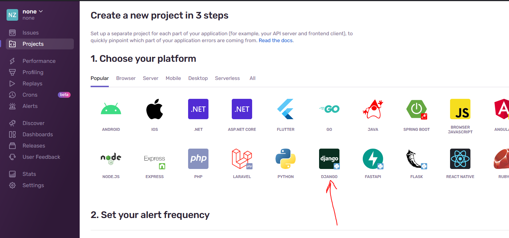

Entrez le nom du projet, puis cliquez sur **Create Project**
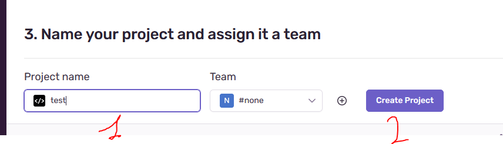

Vous arriverez sur la page de configuration, recopiez le code suivant dans votre fichier [**settings.py**](https://github.com/thomas-barbato/projet-13/blob/master/oc_lettings_site/settings.py) :
```
import sentry_sdk
from sentry_sdk.integrations.django import DjangoIntegration

sentry_sdk.init(
  dsn="https://4b2e52f68c334141a2b9c1ba601f6272@o4505601723269120.ingest.sentry.io/4505609078767616",
  integrations=[DjangoIntegration()],

  # Set traces_sample_rate to 1.0 to capture 100%
  # of transactions for performance monitoring.
  # We recommend adjusting this value in production.
  traces_sample_rate=1.0,

  # If you wish to associate users to errors (assuming you are using
  # django.contrib.auth) you may enable sending PII data.
  send_default_pii=True
)
```
**Attention**, l'adresse DSN est unique à votre projet

Ajoutez une nouvelle route dans l'un de vos fichiers urls.py, nous prendrons par défaut celui du dossier **oc_lettings_site** disponible [**ici**](https://github.com/thomas-barbato/projet-13/blob/master/oc_lettings_site/urls.py)

```
def trigger_error(request):
  division_by_zero = 1 / 0

  urlpatterns = [
    path('sentry-debug/', trigger_error),
    # ...
  ]
```

En cherchant à aller sur l'url **sentry-debug/**, vous ferez alors apparaitre l'erreur dans [**Sentry**](https://sentry.io/) :

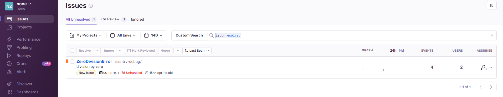

N'oubliez pas de cliquer sur **Enable real-time updates**
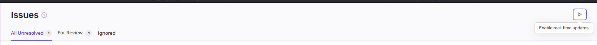

En cliquant sur l'erreur qui vient d'apparaitre, vous serez redirigé vers le rapport qui y est lié :

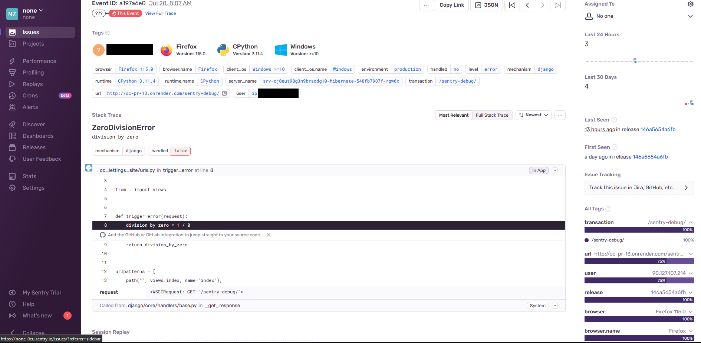

## Commande utile <a name="commande-utile"></a>
|                 commande                  |                                               Effet                                                |
|:------------------------------------------:|:--------------------------------------------------------------------------------------------------:|
| git commit --allow-empty -m "message_vide" | Permet de faire un commit qui ne contiendra rien, mais déclenchera tout de même le pipeline CI/CD. |
