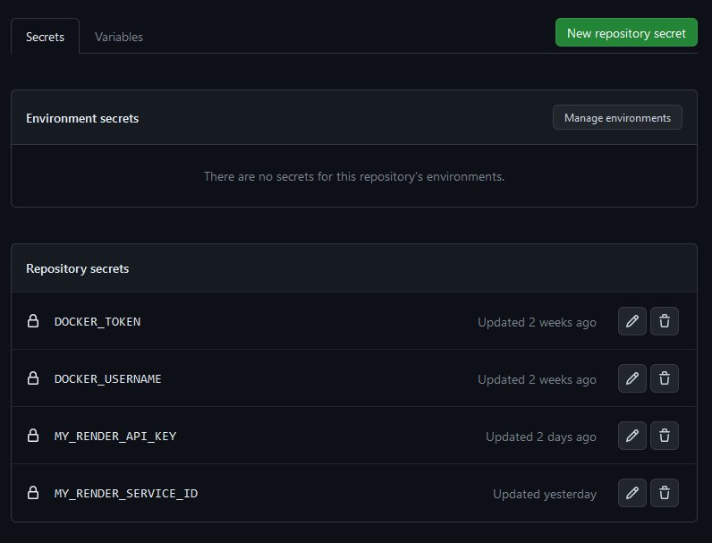

# projet-13 version pre 17/07/2023
# Mettez à l'échelle une application Django en utilisant une architecture modulaire

  
  
  
  
  

## Index

1. [Objectifs du projet 13](#objectifs)
2. [Développement local](#devlocal)
   1. [Prérequis](#devlocal-prereq)
   2. [Linting](#devlocal-linting)
   3. [Tests unitaires](#devlocal-pytest)
   4. [Base de données](#devlocal-bdd)
   5. [Administration](#devlocal-admin)
3. [Docker](#docker)
   1. [Docker local](#docker-local)
   2. [Docker pull](#docker-pull)
4. [Pre-commit](#pre-commit)
   1. [Prérequis](#pre-commit-prereq)
   2. [Description](#pre-commit-description)
   3. [Utilisation manuelle](#pre-commit-manuelle)
5. [Déploiement](#deploiement)
   1. [Prérequis](#deploiement-prereq)
   2. [Description](#deploiement-description)
   3. [Configuration](#deploiement-configuration)

## Objectifs du projet 13 

1. Réduire la dette technique pour le site web d'Orange County Lettings
- Corriger les erreurs de linting
- Corriger la pluralisation des noms de models

2. Refonte de l'architecture modulaire du site
- Division du site en 3 applications (profiles, lettings et oc_lettings_site)
- Transformer oc_lettings_site en projet django
- Créer divers tests

3. Ajout d'un pipeline CI/CD
- Instaurer des tests (linting, black) en pre-commit
- Executer à nouveau les tests pendant un push
- construire et push une image du site avec Docker (sur dockerhub)
- Déployer le site avec Render

4. Surveillance avec sentry

## Développement local 

### Prérequis 

Installez la dernière version de python , **disponible** [**ici**](https://www.python.org/downloads/)

Importez le projet depuis git: `git clone https://github.com/thomas-barbato/projet-13.git`

Créez un environnement virtuel :
`python3 -m venv /path/to/new/virtual/environment`
Ou `python -m virtualenv venv`

Activez l'environnement virtuel:
`cd Venv\Scripts\`
`.\activate.bat`
`cd .. `
`cd .. `

Installez les dépendances:
`pip install -r requirements.txt`

#### Linting 

- `cd /path/to/projet-13`
- `flake8`

#### Tests unitaires 

- `cd /path/to/projet-13`
- `pytest`

#### Base de données 

- `cd /projet-13/oc_lettings_site/`
- Ouvrir une session shell:`sqlite3`
- Se connecter à la base de données: `.open oc-lettings-site.sqlite3`
- Afficher les tables dans la base de données: `.tables`
- Afficher les colonnes dans le tableau des profils: `pragma table_info(oc_lettings_site_profile);`
- Lancer une requête sur la table des profils: `select user_id, favorite_city from
  oc_lettings_site_profile where favorite_city like 'B%';`;
- `.quit` pour quitter

#### Panel d'administration 

- Aller sur `http://localhost:8000/admin`
- Connectez-vous avec l'utilisateur `admin`, mot de passe `Abc1234!`

#### Docker 

##### Pour créer une image docker et la lancer localement 

- Téléchargez et installez docker desktop, disponible ici :
  1. **windows**: [**ici**](https://desktop.docker.com/win/main/amd64/Docker%20Desktop%20Installer.exe?utm_source=docker&utm_medium=webreferral&utm_campaign=dd-smartbutton&utm_location=module)
  2. **linux**: [**ici**](https://docs.docker.com/desktop/linux/install/)

- Lancez Docker desktop
- Depuis une console dans le répertoire du projet, entrez : `docker build -t nomImage .`
- Pour activer l'image: `docker run --rm -p 8000:8000 --name nomContainer nomImage`\
***attention, nomImage doit être le meme que lors du build.***
- Pour y accéder: http://localhost:8000

##### Pour créer une image docker et la lancer localement, depuis dockerhub  

- Téléchargez et installez docker desktop, disponible ici :
  1. **windows**: [**ici**](https://desktop.docker.com/win/main/amd64/Docker%20Desktop%20Installer.exe?utm_source=docker&utm_medium=webreferral&utm_campaign=dd-smartbutton&utm_location=module)
  2. **linux**: [**ici**](https://docs.docker.com/desktop/linux/install/)

- Lancez Docker Desktop
- Depuis une console, entrez : `docker pull casegibson/oc-p13:latest`
- Pour activer l'image: `docker run --rm -p 8000:8000 --name nomContainer casegibson/oc-p13`
- Pour y accéder: http://localhost:8000

## Pre-commit 

### Prérequis 

Pour activer le pre-commit, vous aurez besoin d'installer les bibliothèques qui y sont liées.

Entrez: `pip install -r requirements-dev.txt`

### Description 

Le pre-commit est une série de tests qui surviennent quand on lance un commit, il permet de vérifier
*(selon la configuration choisie)* si ce que vous voulez soumettre est conforme à ce qui est attendu.

### Utilisation manuelle et configuration 

Dans le cas où voudriez vous-même tester le bon fonctionnement du pre-commit:

Entrez: `pre-commit --all-files`

Dans le cas où vous voudriez modifier sa configuration,\
modifiez le fichier [.pre-commit-config.yaml](https://github.com/thomas-barbato/projet-13/blob/master/.pre-commit-config.yaml)

## Déploiement 

### Prérequis 

Pour effectuer le déploiement de l'application, vous aurez besoin de plusieurs comptes :

- [**Github**](https://github.com)
- [**Render**](https://render.com/)
- [**Docker**](https://hub.docker.com/)
- [**Sentry**](https://sentry.io/)

### Description 

Le déploiement de l'application est automatisé grace au pipeline CI/CD "github actions - django".
Lorsque l'ont push vers la branche **master**.

Une fois que vous aurez activé Github action - Django, le fichier [**django.yml**](https://github.com/thomas-barbato/projet-13/blob/master/.github/workflows/django.yml) sera ajouté à votre projet.
C'est ici que vous pourrez y configurer votre pipeline CI/CD.

**Si les tests sont approuvés** :
- Une image docker est créée
- déploiement vers Render

## Configuration du déploiement 

Pour faire fonctionner le pipeline CI/CD, vous devrez créer un **web service** sur le site [**Render**](https://render.com/),
il vous permettra d'héberger votre site web.

Pour ce faire :

1. assurez-vous d'avoir un compte [**Github**](https://github.com)

2. Connectez-vous à votre compte [**Render**](https://render.com/)

3. Cliquez sur **New** et sélectionnez **web service**

4. Liez votre compte render à votre compte github

5. Vous devriez alors voir apparaitre les derniers push fait sur le git, cliquez sur **connect**

6. Vous apparaitrez alors sur la page de déploiement, veillez à remplir correctement les informations demandées.\
Attention, dans la section **Runtime** vous pouvez choisir docker (vous n'aurez rien d'autre à entrer avec ce choix),
ou Python3, auquel cas vous devrez entrer la commande suivante :\
`waitress-serve --listen=*:8000 wsgi:application` \

Pour linux, c'est gunicorn qui est utilisé à la place de waitress, à vous d'adapter selon vos besoins.
Pour cet exemple, nous allons faire le choix de docker

7. Cliquez sur **confirmer**
8. Le déploiement commence, patientez

9. Une fois terminé, vous allez être redirigé vers **overview**

### Renseigner les variables secretes de github

Avant tout, vous devrez créer des variables **secrets** dans votre github.\
Pour y accéder

Veuillez vous rendre dans le menu **settings** de github\

Déroulez le menu **secrets and variables** dans la partie **security**, puis cliquez sur **secrets**

Vous pourrez alors y créer et/ou consulter les variables secretes qui sont liées à ce projet

Pour créer une nouvelle variable, veuillez cliquer sur **new repository secret**

1. entrez un nom
2. entrez une valeur
3. cliquez sur Add secret\
*attention, les espaces ne sont pas tolérés*

Vous devrez alors, pour faire fonctionner le projet 13, insérer plusieurs variables.\
Suivez les indications suivantes :

|  Nom de la variable  |                                                                                                                                                                      Informations                                                                                                                                                                       |
|:--------------------:|:-------------------------------------------------------------------------------------------------------------------------------------------------------------------------------------------------------------------------------------------------------------------------------------------------------------------------------------------------------:|
|   DOCKER_PASSWORD    |                                                                                         Sur le site [**Docker**](https://hub.docker.com/), le mot de passe définit à la création de votre compte **(facultatif, car nous utiliserons DOCKER_TOKEN à la place)**                                                                                         |
|     DOCKER_TOKEN     | Sur le site [**Docker**](https://hub.docker.com/), dans votre profil cliquez sur **account settings** puis **security** et **new access token**, veillez à bien noter la valeur qui sera générée car vous ne pourrez pas la récupérer autrement, donnez les accès **Read, Write, Delete**. La clé commence toujours par la suite de caractères **dckr** |
|   DOCKER_USERNAME    |                                                                                                                    Sur le site [**Docker**](https://hub.docker.com/), votre nom d'utilisateur définit à la création de votre compte                                                                                                                     |
|  MY_RENDER_API_KEY   |     Sur le site [**Render**](https://render.com/) , cliquez sur votre profile, puis sur **account settings** puis sur **API Keys**, ensuite sur **Create API Key**, entrez un nom et veillez à bien noter la valeur qui sera générée car vous ne pourrez pas la récupérer autrement  . La clé commence toujours par la suite de caractères **rnd_**     |
| MY_RENDER_SERVICE_ID |                                           Sur le site [**Render**](https://render.com/), selectionnez le **web service** déjà créé puis, rendez-vous **settings**, vous y trouverez **Deploy Hook** et copiez-coller la ligne qu'elle contient. La clé commence toujours par la suite de caractères **srv-**                                            |
